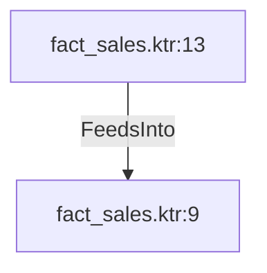

# fact_sales.ktr:13 (TransformNode)

## Properties

| Key | Value |
|---|---|
| `columns` | [] |
| `node_type` | Source |
| `object_name` | dim_sales_person |

## Relationships

### FeedsInto

- → fact_sales.ktr:9 (`71039590-7ed6-5761-a7c7-95fe29d56665`)

## Diagram

## Evidence

- `8f697512-99c7-5eee-9f8d-18bb579150e0` — dim_sales_person (confidence: 1.00)
