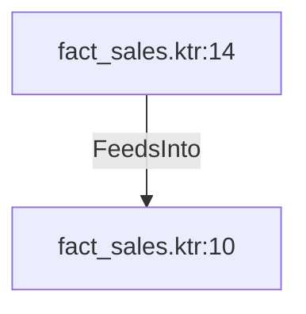

# fact_sales.ktr:14 (TransformNode)

## Properties

| Key | Value |
|---|---|
| `columns` | [] |
| `node_type` | Source |
| `object_name` | eae_data_management_mmjja.dim_sales_territory |

## Relationships

### FeedsInto

- → fact_sales.ktr:10 (`0b3339b9-475a-55b0-bb7e-cb7e7c34fa8c`)

## Diagram

## Evidence

- `d62e247a-8002-539c-9452-bf10f0acde69` — eae_data_management_mmjja.dim_sales_territory (confidence: 1.00)
