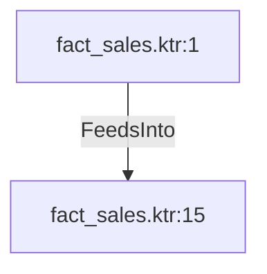

# fact_sales.ktr:15 (TransformNode)

## Properties

| Key | Value |
|---|---|
| `node_type` | Unmapped |
| `raw` | <step>
    <name>Insert / Update fact_sales</name>
    <type>InsertUpdate</type>
    <description/>
    <distribute>Y</distribute>
    <custom_distribution/>
    <copies>1</copies>
    <partitioning>
      <method>none</method>
      <schema_name/>
    </partitioning>
    <connection>LocalMySQL-dataMart</connection>
    <commit>100</commit>
    <update_bypassed>N</update_bypassed>
    <lookup>
      <schema>eae_data_management_mmjja</schema>
      <table>fact_sales</table>
      <key>
        <name>SalesOrderDetailID</name>
        <field>sales_order_detail_id</field>
        <condition>=</condition>
        <name2/>
      </key>
      <value>
        <name>sales_profit</name>
        <rename>calculated_sales_profit</rename>
        <update>Y</update>
      </value>
      <value>
        <name>ship_date_datetime</name>
        <rename>ShipDate</rename>
        <update>Y</update>
      </value>
      <value>
        <name>ship_date_id</name>
        <rename>calculated_ship_date_id</rename>
        <update>Y</update>
      </value>
      <value>
        <name>sales_order_number</name>
        <rename>SalesOrderNumber</rename>
        <update>Y</update>
      </value>
      <value>
        <name>sales_order_id</name>
        <rename>SalesOrderID</rename>
        <update>N</update>
      </value>
      <value>
        <name>sales_order_detail_id</name>
        <rename>SalesOrderDetailID</rename>
        <update>N</update>
      </value>
      <value>
        <name>total_discount</name>
        <rename>calculated_discount_amount</rename>
        <update>Y</update>
      </value>
      <value>
        <name>total_amount</name>
        <rename>LineTotal</rename>
        <update>Y</update>
      </value>
      <value>
        <name>product_unit_price_discount</name>
        <rename>UnitPriceDiscount</rename>
        <update>Y</update>
      </value>
      <value>
        <name>product_unit_price</name>
        <rename>UnitPrice</rename>
        <update>Y</update>
      </value>
      <value>
        <name>order_qty</name>
        <rename>OrderQty</rename>
        <update>Y</update>
      </value>
      <value>
        <name>dim_product_id</name>
        <rename>dim_product_id</rename>
        <update>Y</update>
      </value>
      <value>
        <name>dim_sales_person_id</name>
        <rename>dim_sales_person_id</rename>
        <update>Y</update>
      </value>
      <value>
        <name>dim_sales_territory_id</name>
        <rename>calculated_dim_sales_territory_id</rename>
        <update>Y</update>
      </value>
      <value>
        <name>dim_customer_id</name>
        <rename>dim_customer_id</rename>
        <update>Y</update>
      </value>
      <value>
        <name>order_date_id</name>
        <rename>calculated_order_date_id</rename>
        <update>Y</update>
      </value>
      <value>
        <name>order_date_datetime</name>
        <rename>OrderDate</rename>
        <update>Y</update>
      </value>
      <value>
        <name>product_standard_cost_on_day</name>
        <rename>StandardCost</rename>
        <update>Y</update>
      </value>
    </lookup>
    <attributes/>
    <cluster_schema/>
    <remotesteps>
      <input>
      </input>
      <output>
      </output>
    </remotesteps>
    <GUI>
      <xloc>608</xloc>
      <yloc>64</yloc>
      <draw>Y</draw>
    </GUI>
  </step> |
| `reason` | unrecognized step type: InsertUpdate |

## Relationships

### FeedsInto

- ← fact_sales.ktr:1 (`8a7a52f7-5eb6-5d48-99cb-406921ca48f6`)

## Diagram

## Evidence

- `4fbcac5c-ab28-5aec-9148-564fce771c71` — <step>
    <name>Insert / Update fact_sales</name>
    <type>InsertUpdate</type>
    <description/>
    <distribute>Y</distribute>
    <custom_distribution/>
    <copies>1</copies>
    <partitioning>
      <method>none</method>
      <schema_name/>
    </partitioning>
    <connection>LocalMySQL-dataMart</connection>
    <commit>100</commit>
    <update_bypassed>N</update_bypassed>
    <lookup>
      <schema>eae_data_management_mmjja</schema>
      <table>fact_sales</table>
      <key>
        <name>SalesOrderDetailID</name>
        <field>sales_order_detail_id</field>
        <condition>=</condition>
        <name2/>
      </key>
      <value>
        <name>sales_profit</name>
        <rename>calculated_sales_profit</rename>
        <update>Y</update>
      </value>
      <value>
        <name>ship_date_datetime</name>
        <rename>ShipDate</rename>
        <update>Y</update>
      </value>
      <value>
        <name>ship_date_id</name>
        <rename>calculated_ship_date_id</rename>
        <update>Y</update>
      </value>
      <value>
        <name>sales_order_number</name>
        <rename>SalesOrderNumber</rename>
        <update>Y</update>
      </value>
      <value>
        <name>sales_order_id</name>
        <rename>SalesOrderID</rename>
        <update>N</update>
      </value>
      <value>
        <name>sales_order_detail_id</name>
        <rename>SalesOrderDetailID</rename>
        <update>N</update>
      </value>
      <value>
        <name>total_discount</name>
        <rename>calculated_discount_amount</rename>
        <update>Y</update>
      </value>
      <value>
        <name>total_amount</name>
        <rename>LineTotal</rename>
        <update>Y</update>
      </value>
      <value>
        <name>product_unit_price_discount</name>
        <rename>UnitPriceDiscount</rename>
        <update>Y</update>
      </value>
      <value>
        <name>product_unit_price</name>
        <rename>UnitPrice</rename>
        <update>Y</update>
      </value>
      <value>
        <name>order_qty</name>
        <rename>OrderQty</rename>
        <update>Y</update>
      </value>
      <value>
        <name>dim_product_id</name>
        <rename>dim_product_id</rename>
        <update>Y</update>
      </value>
      <value>
        <name>dim_sales_person_id</name>
        <rename>dim_sales_person_id</rename>
        <update>Y</update>
      </value>
      <value>
        <name>dim_sales_territory_id</name>
        <rename>calculated_dim_sales_territory_id</rename>
        <update>Y</update>
      </value>
      <value>
        <name>dim_customer_id</name>
        <rename>dim_customer_id</rename>
        <update>Y</update>
      </value>
      <value>
        <name>order_date_id</name>
        <rename>calculated_order_date_id</rename>
        <update>Y</update>
      </value>
      <value>
        <name>order_date_datetime</name>
        <rename>OrderDate</rename>
        <update>Y</update>
      </value>
      <value>
        <name>product_standard_cost_on_day</name>
        <rename>StandardCost</rename>
        <update>Y</update>
      </value>
    </lookup>
    <attributes/>
    <cluster_schema/>
    <remotesteps>
      <input>
      </input>
      <output>
      </output>
    </remotesteps>
    <GUI>
      <xloc>608</xloc>
      <yloc>64</yloc>
      <draw>Y</draw>
    </GUI>
  </step> (confidence: 1.00)
