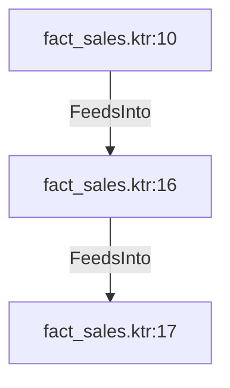

# fact_sales.ktr:16 (TransformNode)

## Properties

| Key | Value |
|---|---|
| `node_type` | Unmapped |
| `raw` | <step>
    <name>Product Lookup</name>
    <type>DimensionLookup</type>
    <description/>
    <distribute>Y</distribute>
    <custom_distribution/>
    <copies>1</copies>
    <partitioning>
      <method>none</method>
      <schema_name/>
    </partitioning>
    <schema>eae_data_management_mmjja</schema>
    <table>dim_product</table>
    <connection>LocalMySQL-dataMart</connection>
    <commit>100</commit>
    <update>N</update>
    <fields>
      <key>
        <name>ProductID</name>
        <lookup>product_id</lookup>
      </key>
      <date>
        <name>OrderDate</name>
        <from>start_date</from>
        <to>end_date</to>
      </date>
      <return>
        <name>dim_product_id</name>
        <rename/>
        <creation_method>tablemax</creation_method>
        <use_autoinc>N</use_autoinc>
        <version>version_number</version>
      </return>
    </fields>
    <sequence/>
    <min_year>1900</min_year>
    <max_year>2199</max_year>
    <cache_size>5000</cache_size>
    <preload_cache>N</preload_cache>
    <use_start_date_alternative>N</use_start_date_alternative>
    <start_date_alternative>none</start_date_alternative>
    <start_date_field_name/>
    <useBatch>N</useBatch>
    <attributes/>
    <cluster_schema/>
    <remotesteps>
      <input>
      </input>
      <output>
      </output>
    </remotesteps>
    <GUI>
      <xloc>208</xloc>
      <yloc>304</yloc>
      <draw>Y</draw>
    </GUI>
  </step> |
| `reason` | unrecognized step type: DimensionLookup |

## Relationships

### FeedsInto

- → fact_sales.ktr:17 (`554cd6c2-c25d-58d5-878d-13b2dd0210ab`)
- ← fact_sales.ktr:10 (`0b3339b9-475a-55b0-bb7e-cb7e7c34fa8c`)

## Diagram

## Evidence

- `ce499f20-7964-50df-9207-02e5bdc481fc` — <step>
    <name>Product Lookup</name>
    <type>DimensionLookup</type>
    <description/>
    <distribute>Y</distribute>
    <custom_distribution/>
    <copies>1</copies>
    <partitioning>
      <method>none</method>
      <schema_name/>
    </partitioning>
    <schema>eae_data_management_mmjja</schema>
    <table>dim_product</table>
    <connection>LocalMySQL-dataMart</connection>
    <commit>100</commit>
    <update>N</update>
    <fields>
      <key>
        <name>ProductID</name>
        <lookup>product_id</lookup>
      </key>
      <date>
        <name>OrderDate</name>
        <from>start_date</from>
        <to>end_date</to>
      </date>
      <return>
        <name>dim_product_id</name>
        <rename/>
        <creation_method>tablemax</creation_method>
        <use_autoinc>N</use_autoinc>
        <version>version_number</version>
      </return>
    </fields>
    <sequence/>
    <min_year>1900</min_year>
    <max_year>2199</max_year>
    <cache_size>5000</cache_size>
    <preload_cache>N</preload_cache>
    <use_start_date_alternative>N</use_start_date_alternative>
    <start_date_alternative>none</start_date_alternative>
    <start_date_field_name/>
    <useBatch>N</useBatch>
    <attributes/>
    <cluster_schema/>
    <remotesteps>
      <input>
      </input>
      <output>
      </output>
    </remotesteps>
    <GUI>
      <xloc>208</xloc>
      <yloc>304</yloc>
      <draw>Y</draw>
    </GUI>
  </step> (confidence: 1.00)
