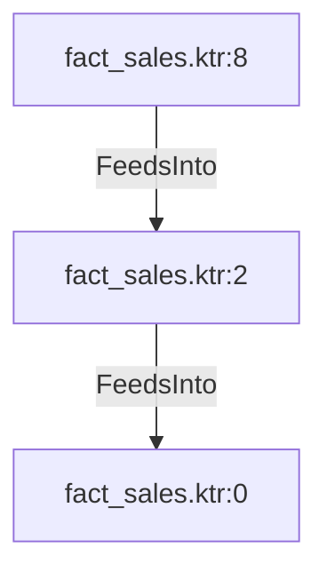

# fact_sales.ktr:2 (TransformNode)

## Properties

| Key | Value |
|---|---|
| `node_type` | Unmapped |
| `raw` |  |
| `reason` | Calculator step has no recognizable calculated fields |

## Relationships

### FeedsInto

- → fact_sales.ktr:0 (`bd436d40-4053-57f4-ac77-b4ffe37edae4`)
- ← fact_sales.ktr:8 (`aa78f67a-b68c-54eb-9ca8-6621c38a74d2`)

## Diagram

## Evidence

- `7dbe17c0-570f-5fa1-8317-47e3fa7fe9f3` —  (confidence: 1.00)
