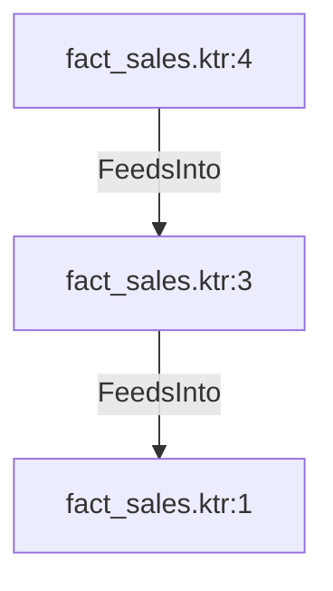

# fact_sales.ktr:3 (TransformNode)

## Properties

| Key | Value |
|---|---|
| `excerpt` | <unparsed condition> |
| `node_type` | Filter |

## Relationships

### FeedsInto

- → fact_sales.ktr:1 (`8a7a52f7-5eb6-5d48-99cb-406921ca48f6`)
- ← fact_sales.ktr:4 (`8eb94913-b4b9-5d88-915d-7fb890edd830`)

## Diagram

## Evidence

- `5e977e4c-2034-50a4-848c-852ec38863fd` — <unparsed condition> (confidence: 1.00)
