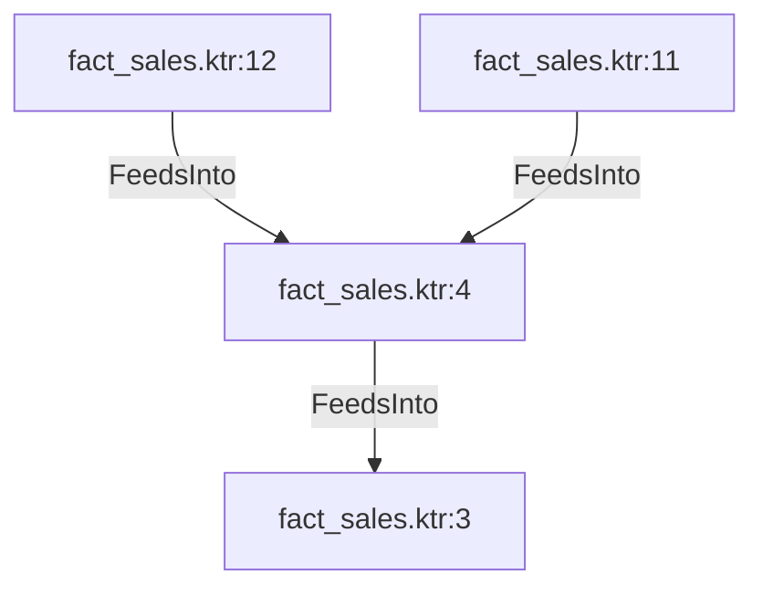

# fact_sales.ktr:4 (TransformNode)

## Properties

| Key | Value |
|---|---|
| `join_kind` | Inner |
| `keys` | [] |
| `left` | 0 |
| `node_type` | Join |
| `right` | 0 |

## Relationships

### FeedsInto

- → fact_sales.ktr:3 (`699832f8-de69-55f9-966f-acf7612b60b1`)
- ← fact_sales.ktr:12 (`e54591c9-e1d9-5880-8eba-f77196e45271`)
- ← fact_sales.ktr:11 (`2030487e-b783-55a3-9e9e-d57fb30fd2d9`)

## Diagram

## Evidence

- `cb34a399-3b1e-5852-80e2-34384881857e` — Inner JOIN ON [] (confidence: 1.00)
