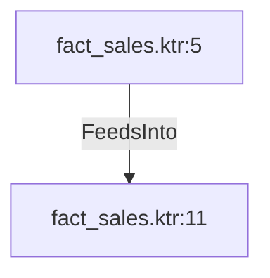

# fact_sales.ktr:5 (TransformNode)

## Properties

| Key | Value |
|---|---|
| `columns` | [] |
| `node_type` | Source |
| `object_name` | Production.ProductCostHistory |

## Relationships

### FeedsInto

- → fact_sales.ktr:11 (`2030487e-b783-55a3-9e9e-d57fb30fd2d9`)

## Diagram

## Evidence

- `f39547c8-708c-51ad-a1f9-0a3da320766d` — Production.ProductCostHistory (confidence: 1.00)
