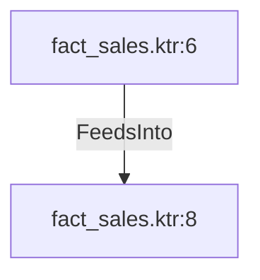

# fact_sales.ktr:6 (TransformNode)

## Properties

| Key | Value |
|---|---|
| `columns` | [] |
| `node_type` | Source |
| `object_name` | Sales.SalesOrderDetail |

## Relationships

### FeedsInto

- → fact_sales.ktr:8 (`aa78f67a-b68c-54eb-9ca8-6621c38a74d2`)

## Diagram

## Evidence

- `ef6dbadb-cf3f-5722-ade6-6ff552273ee5` — Sales.SalesOrderDetail (confidence: 1.00)
