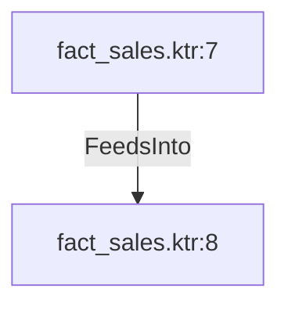

# fact_sales.ktr:7 (TransformNode)

## Properties

| Key | Value |
|---|---|
| `columns` | [] |
| `node_type` | Source |
| `object_name` | Sales.SalesOrderHeader |

## Relationships

### FeedsInto

- → fact_sales.ktr:8 (`aa78f67a-b68c-54eb-9ca8-6621c38a74d2`)

## Diagram

## Evidence

- `5609abf0-cabc-57f9-a39e-a64047affb91` — Sales.SalesOrderHeader (confidence: 1.00)
