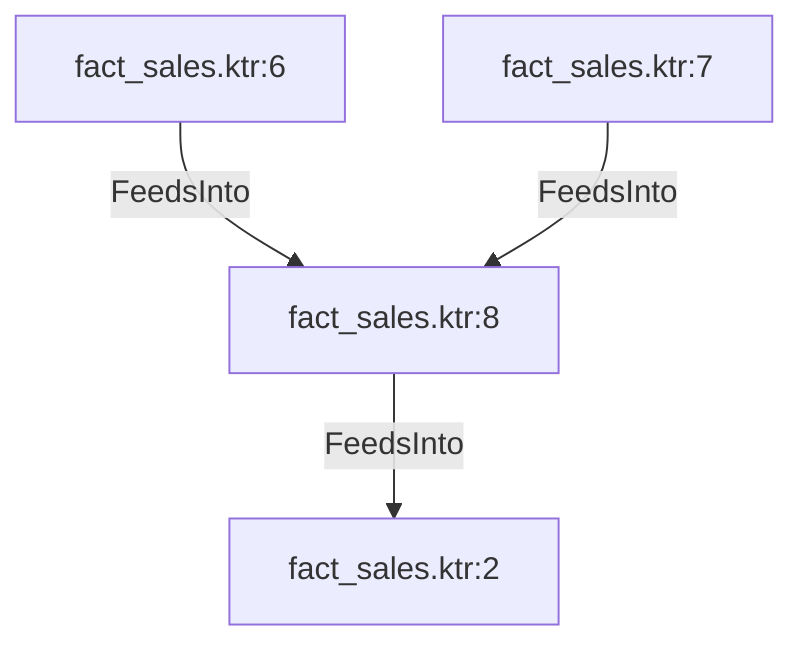

# fact_sales.ktr:8 (TransformNode)

## Properties

| Key | Value |
|---|---|
| `join_kind` | Left |
| `keys` | [] |
| `left` | 0 |
| `node_type` | Join |
| `right` | 0 |

## Relationships

### FeedsInto

- → fact_sales.ktr:2 (`0c1ebe1c-8159-5483-9e8d-8a04c7c91a2e`)
- ← fact_sales.ktr:6 (`c0377251-0bee-537c-801c-875029ca73c3`)
- ← fact_sales.ktr:7 (`bea3d187-f2a9-59d3-95a3-22ce0b060c44`)

## Diagram

## Evidence

- `f4ce116b-f8d0-539d-9232-0dd4520c968c` — Left JOIN ON [] (confidence: 1.00)
