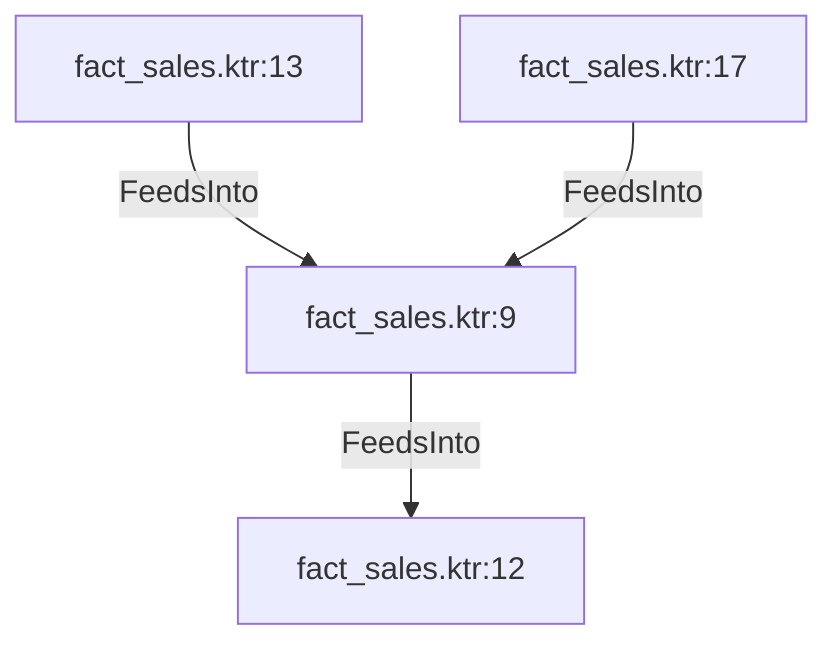

# fact_sales.ktr:9 (TransformNode)

## Properties

| Key | Value |
|---|---|
| `join_kind` | Left |
| `keys` | [] |
| `left` | 0 |
| `node_type` | Join |
| `right` | 0 |

## Relationships

### FeedsInto

- → fact_sales.ktr:12 (`e54591c9-e1d9-5880-8eba-f77196e45271`)
- ← fact_sales.ktr:13 (`3d941052-bd4a-5d8c-92a5-48d0d0a4cc75`)
- ← fact_sales.ktr:17 (`554cd6c2-c25d-58d5-878d-13b2dd0210ab`)

## Diagram

## Evidence

- `d49bc0f0-86d3-5269-af00-b22d6ea19799` — Left JOIN ON [] (confidence: 1.00)
