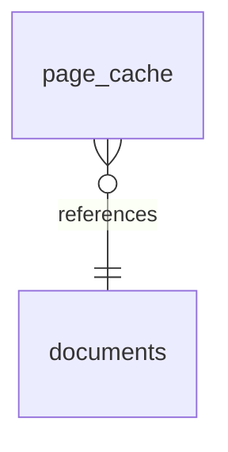

# RFC 0091 — SQLAlchemy ORM Model Recognition (Python)

**Status:** Accepted
**Author:** EKOS team
**Created:** 2026-08-25
**Implemented:** 2026-08-25

---

## Motivation

Confirmed real gap, found live against a real project (`pdf-reader`'s `backend/app/db/models.py`)
and explicitly deferred at RFC 0090's own filing: no analyzer anywhere recognizes an ORM-declared
schema and promotes it to a `Table`/`Dataset` KIR object — only raw SQL DDL (`sql_analyzer.rs`,
`clickhouse_analyzer.rs`) does. A real, common shape —

```python
class Document(Base):
    __tablename__ = "documents"
    file_hash: Mapped[str] = mapped_column(String(64), primary_key=True)
    filename: Mapped[str] = mapped_column(String(512))
    page_count: Mapped[int] = mapped_column(Integer)

class PageCache(Base):
    __tablename__ = "page_cache"
    file_hash: Mapped[str] = mapped_column(String(64), ForeignKey("documents.file_hash"))
```

— compiles today only into two ordinary `Custom("PythonSymbol")` class objects. `##
Data Architecture` and `## Entity Relationships` (both `docs-gen`, both filter on
`ObjectKind::Table`) render nothing for a project whose entire schema is ORM-declared, which is
the majority shape for a modern Python/SQLAlchemy backend — `pdf-reader` has no raw SQL DDL
anywhere.

## Design

### Scope: Python/SQLAlchemy only, v1

The one real, live-verifiable ORM available this session. Django `models.Model`, other Python
ORMs, and other languages' ORMs (Ecto, ActiveRecord, TypeORM/Prisma, ...) are real, legitimate
extensions of this same idea but are explicit non-goals here — not attempted without a real
project to verify against, matching a repeated, hard-learned lesson from this session's other
fixes (a change that looks obviously correct by inspection can still be wrong against real data;
several fixes this session were only caught by rebuilding against `pdf-reader`'s real ledger).

### Detection

A class is recognized as an ORM model when its body contains a `__tablename__ = "..."`
string-literal assignment — SQLAlchemy-specific, unambiguous, and syntactically simple to detect
via the existing `string_constant` helper. Deliberately **not** based on tracing the class's
`bases` back to a `declarative_base()`/`DeclarativeBase` definition — that's fragile against
aliasing and re-exports; `__tablename__` is sufficient and matches this codebase's established
preference for concrete syntactic signals over base-class heuristics (e.g. `is_real_readme_name`,
`looks_like_code_reference`).

### Column and foreign-key extraction

Real column *names* plus a best-effort `data_type` hint — the callable name of the column-type
call (`String`/`Integer`/`DateTime`/...) when the first positional argument to
`mapped_column(...)`/`Column(...)` is itself a call; `"unknown"` when it can't be determined,
never fabricated. No full SQL type-system mapping — out of scope.

A `ForeignKey("table.column")` string-literal argument nested in a column's
`mapped_column`/`Column` call is resolved against tablenames collected from a pre-pass over every
`ClassDef` in the *same file* (handles forward and backward references within one file — the real
shape `pdf-reader` has: `Document`/`PageCache`/`TranslationCache` all in `db/models.py`).
Unresolvable within the same file: the column is still extracted with no FK edge emitted for it —
an honest gap, not a fabricated edge to a possibly-nonexistent id (this session found and fixed
several real "dangling relationship" bugs from exactly this kind of premature edge creation; not
adding a new one here).

### Object model

Reuses `crates/recovery/src/sql_analyzer.rs`'s existing conventions exactly, so column data reads
identically regardless of origin:
- `ObjectKind::Table`, named by the real `__tablename__` value (not the class name).
- `columns` property: `[{"name": ..., "data_type": ...}]` — the same array shape
  `sql_analyzer.rs::columns_json` already produces.
- `RelationshipKind::ForeignKey` edges: same `fk_desc` property and `from:to:fk_desc`-hashed id
  scheme as `sql_analyzer.rs::add_fk_relationship` (a table can have two FK columns to the same
  target).
- Id scheme: `Uuid::v5("python-orm-table:{tablename.to_lowercase()}")` — analyzer-prefixed, the
  same precedent `sql_analyzer.rs`/`clickhouse_analyzer.rs` already established (their own table
  ids are prefixed `sql-analyzer-table:`/`clickhouse:` specifically so same-named tables from
  different real systems never accidentally collide onto one id). Cross-origin recognition of
  "this ORM table and this DDL table describe the same real thing" is left to the existing
  identity-resolution mechanism (name + kind matching), not to sharing an id.

Lives inside `python_analyzer.rs`'s existing `ClassDef` handling (already visits every class) —
not a new analyzer pass. The class's existing `Custom("PythonSymbol")` object is unchanged; the
new `Table` object is additional, `Contains`-linked from the same `file_id` (matches `add_symbol`'s
own linking convention, so RFC 0089's "Defined in" resolution works for the new object too).

**Known residual risk, stated explicitly rather than glossed over**: naming the `Table` object by
`__tablename__` (`"documents"`) rather than the class name (`"Document"`) avoids a same-name-
different-kind identity conflict against the `PythonSymbol` object in the common case (SQLAlchemy's
own pluralization convention already keeps these apart), but this is not a hard guarantee for every
project's naming style — the same category of residual risk `devlog_102` already documented for a
different real identity-conflict case (npm packages colliding as both `Technology` and `JsModule`).
If it happens, `ekos resolve` will correctly flag it for review, not silently merge.

### Companion rendering fix

`docs-gen::render_data_architecture`'s Data Stores listing reads only `store.name` plus
relationship-derived counts today — real `columns` data (from *either* origin) is compiled but
never rendered anywhere. Adds one sub-line per store listing real column names (+ data_type when
known) when the property is present — small, additive, and benefits existing SQL-DDL-derived
tables retroactively, not just the new ORM-derived ones.

## Non-goals

- Django/other Python ORMs, other languages' ORMs — real future extensions, not attempted without
  a real project to verify against.
- Cross-file foreign-key resolution — same-file only for v1.
- Full SQL type-system inference — a best-effort callable-name hint only.
- Automatic cross-linking between the `PythonSymbol` and `Table` objects representing the same
  class — none exists in this codebase for any "one construct, two kinds" case today (confirmed:
  `DefaultResolver` surfaces it as a reviewable conflict, never auto-merges); not invented here.

## Verification

7 new `python_analyzer.rs` tests (real model recognition alongside the unchanged `PythonSymbol`,
a negative case for a plain non-ORM class, same-file FK resolution in both declaration orders,
an honest skip for a cross-file-unresolvable FK, a bare-type-reference `data_type` hint case) + 1
new `docs-gen` test (column listing, honest omission when absent). Full workspace gate
(`fmt`/`build`/`clippy -D warnings`/`test --workspace`, 101/101 groups) clean, `tests/integration`
3/3.

Live-verified against `pdf-reader`'s real whole-project ledger (`db/models.py`'s real `Document`/
`PageCache`/`TranslationCache` SQLAlchemy models): 3 new `Table` objects compiled (119 objects,
165 relationships, up from 116/161), each with real, correct columns —

```
- **documents** — 1 real foreign-key edge(s), read by 0 transformation(s), written by 0 transformation(s)
  - Columns: file_hash (String), filename (String), path (String), page_count (Integer), created_at (DateTime)
- **page_cache** — 1 real foreign-key edge(s), read by 0 transformation(s), written by 0 transformation(s)
  - Columns: id (Integer), file_hash (String), page_num (Integer), engine (String), text (Text), bboxes_json (Text), created_at (DateTime)
- **translation_cache** — 0 real foreign-key edge(s), read by 0 transformation(s), written by 0 transformation(s)
  - Columns: id (Integer), file_hash (String), page_num (Integer), text_hash (String), target_lang (String), kind (String), result (Text), created_at (DateTime)
```

— and `## Entity Relationships` now renders a real ER diagram from the real foreign key:



`translation_cache` correctly shows 0 FK edges (its real source has none) — not fabricated to
match its siblings. `## Data Architecture` and `## Entity Relationships` were both previously
empty/gap-only for this project (no raw SQL DDL anywhere in scope); both now render real content
with zero changes to either renderer's core logic beyond the one additive column-listing line.
