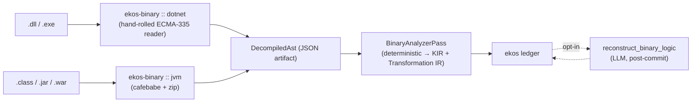

# RFC 0148 — .NET & Java binary recovery, and LLM business-logic reconstruction

**Status:** Accepted — implementation moved out of this repository into the private
`alexeyban/ekos-binary` workspace by RFC 0149 (2026-09-18); this design document stays public.
**Date:** 2026-09-18
**Supersedes:** none
**Related:** RFC 0027 (Transformation IR), RFC 0028 (`ekos_transformation_explain`),
RFC 0043 (redaction), RFC 0088 (`llm_description`, the post-`commit` LLM slot),
RFC 0135 (provenance & determinism), RFC 0147 (Perl connector — the shell-out precedent)

---

## Summary

Recover business logic from compiled .NET assemblies (`.dll`/`.exe`) and Java bytecode
(`.class`/`.jar`/`.war`/`.ear`) where no source is available, and compile it into the same
evidence-backed KIR and Transformation IR every other EKOS analyzer targets.

Two stages, shipped in that order and separable:

1. **Deterministic structural recovery** (Phases 1–2) — read the binary's own metadata and
   bytecode directly, in pure safe Rust, with no external toolchain and no LLM. Produces types,
   methods, fields, signatures, the real call graph, branch structure, string/numeric literals,
   and external-I/O boundaries (JDBC, ADO.NET, HTTP, file), each carrying a provenance locator
   down to the bytecode offset or metadata token.
2. **LLM business-logic reconstruction** (Phases 3–4) — an opt-in, post-`commit` pass that reads
   *only* the structural facts recovered in stage 1 and infers business-meaningful names and
   input→condition→output rules, every one of them linked back to the exact methods and offsets
   it was derived from, scored for confidence, and routed through the conflict path when
   reconstructions disagree.

Stage 1 is never generative and never fails a whole file. Stage 2 never runs without stage 1's
evidence under it, and is never presented with the same certainty.

---

## Motivation

EKOS's wedge is "no readable source." Pentaho `.ktr`/`.kjb` (RFC 0027) proved the shape: a
business-critical artefact nobody can read, compiled into evidence-backed facts. Compiled .NET
and Java binaries are the same failure mode at much larger scale — in-house line-of-business
apps, acquired-company systems, unmaintained vendor DLLs and JARs — where the source was lost,
the vendor is gone, or the repo was never checked in.

This is the majority case in the exact mid-size enterprise segment EKOS targets. Enterprise .NET
(WinForms/WebForms/early ASP.NET) and Java (Spring/EJB/J2EE) applications from the 2000s–2010s
routinely encode pricing, eligibility, tax and discounting rules that exist nowhere else.

It also extends the Unified Transformation Semantics story: Pentaho, SQL, stored procedures and
now .NET/Java methods all compile into one Transformation IR, so binary-derived logic is diffable
against a drafted rewrite through the existing `ekos_transformation_diff` with no new consumer
tooling.

---

## Non-goals

- **Not a general-purpose decompiler.** This RFC does not reconstruct compilable source.
- **Not native code.** IL and JVM bytecode only — no C/C++, no .NET Native AOT, no GraalVM
  `native-image` output.
- **Not obfuscated or packed binaries in v1.** Detection is in scope (so the pass can say so);
  de-obfuscation is not.
- **Not a replacement codebase.** The output is KIR facts and Transformation IR, not a rewrite.
- **Not statement-level decompiled source in v1.** See "Fidelity levels" below — this is the one
  real capability the in-process design gives up, and it is bounded and named.

---

## Architecture

### The decision that differs from the originating draft

The originating draft specified **out-of-process sidecars**: a .NET console app wrapping
ICSharpCode.Decompiler and a JVM jar wrapping Vineflower, spawned per file over stdio JSON.

This RFC rejects that as the v1 default, on this project's own established precedent. RFC 0147
rejected shelling out to `perl -MO=Deparse`/`PPI` on three grounds; the first two apply
identically here, and a fourth is specific to binaries:

1. **It requires a toolchain wherever `ekos recover` runs.** A .NET SDK and a JRE on every
   machine and CI runner that compiles a workspace. The development machine this RFC was written
   on has no `dotnet` at all and only a JRE.
2. **It breaks reproducible builds.** Decompiler output varies by decompiler version; the facts
   in an append-only ledger would then depend on what happened to be installed.
3. **`CompilerPass`es must be deterministic and side-effect-free** (CLAUDE.md, Coding Rules).
   Spawning per-file subprocesses is neither.
4. **It needs a security review before it can ship.** The draft says so itself: a customer's DLL
   or JAR is untrusted input, and sandboxing a subprocess that reads it is a prerequisite, not a
   follow-up. Reading bytes in-process with no `unsafe` and no execution sidesteps the question
   entirely.

JVM class files and .NET CLI metadata are **fully-specified, stable, static formats** (JVMS §4,
ECMA-335 §II). Everything stage 2 actually needs — types, methods, signatures, literals, the
call graph, branch structure, I/O call targets — is in that metadata and bytecode, readable
without reconstructing source.

**Decision:** in-process pure-Rust readers are the v1 default. The sidecar is retained as a
*defined but unbuilt* second backend behind the same `DecompiledAst` seam (see "Fidelity
levels"), for deployments that install the toolchains and want full method bodies.

### Shape

| Component | Location | Role |
|---|---|---|
| `ekos-binary` | `crates/binary` | `DecompiledAst` + the `jvm` and `dotnet` backends. Pure library: no compiler, ledger or LLM dependency. |
| `BinaryObserver` | `plugins/binary` | Walks the tree, detects binaries by **magic bytes**, runs the backend, emits one `DecompiledAst` JSON artifact per type. |
| `BinaryAnalyzerPass` | `crates/recovery/src/binary_analyzer.rs` | `DecompiledAst` → KIR objects/relationships/evidence + Transformation IR. Zero LLM. |
| `reconstruct_binary_logic` | `crates/recovery/src/binary_reconstruction.rs` | Phase 3/4. Post-`commit` LLM pass over committed structural facts, in RFC 0088's slot. |

### Why the observer parses

Every other code connector stores source verbatim and lets the analyzer parse it. A binary has no
source to store, and storing megabytes of base64 IL in the artifact store would be unsearchable,
un-redactable (RFC 0043's pattern table cannot meaningfully scan a PE image) and enormous.

`plugins/localdocs` is the existing precedent: it extracts text from PDF and DOCX at observation
time rather than storing the container. `BinaryObserver` does the same thing one level up — the
`DecompiledAst` is the binary's readable projection, exactly as extracted text is a PDF's. It is
JSON, so it is searchable, redactable, diffable and content-addressable like every other
artifact, and the original file's SHA-256 is carried on it so the two-hop provenance chain closes.

---

## Stage 1 — structural recovery

### JVM backend

`cafebabe` 0.9 (**0BSD**, pure safe Rust) parses class files including the constant pool and the
`Code` attribute's decoded opcodes. `zip` 2 (already a workspace dependency, used by
`plugins/localdocs` for DOCX) reads `.jar`/`.war`/`.ear` members.

Verified before this RFC was accepted: **652 of 652** real classes in `/usr/share/java/pdfbox.jar`
parsed, with methods, fields and decoded bytecode.

### .NET backend — hand-rolled, and why

Two crates exist and both were rejected on evidence, not preference:

| Crate | Verdict |
|---|---|
| `dotnetdll` 0.3 | **GPL-3.0+.** EKOS is MIT. Linking it in-process would be a licence violation; this is not a judgement call. |
| `dotscope` 0.9.1 | Apache-2.0 and otherwise appealing, but **parsed only 77 of 147 real Mono assemblies (52%)** — it aborts the *entire file* in its custom-attribute loader on a blob it mis-reads. |

That 48% failure rate is disqualifying, and specifically so for this project: the same
whole-file, all-or-nothing parse failure is what silently cost LedgerSMB its entire 103-table
schema under RFC 0146, surfacing only as one buried diagnostic. A binary analyzer that returns
zero facts for half of a customer's assemblies — with no error the user will notice — is worse
than one that does not exist, because it looks like it worked.

So the .NET backend is a **hand-rolled, deliberately lenient ECMA-335 reader**: PE → CLI header →
metadata root → `#~`/`#Strings`/`#US`/`#Blob`/`#GUID` streams → the tables we need → IL method
bodies. It is ~1.5k lines of safe Rust with no dependencies, and — the entire point — it
**degrades per row, never per file**. A malformed signature blob costs one method its rendered
descriptor; a malformed custom attribute costs nothing at all, because v1 does not read custom
attributes. Every degradation is recorded as an `AstDiagnostic` on the AST rather than discarded.

Tables read: `Module`, `TypeRef`, `TypeDef`, `Field`, `MethodDef`, `Param`, `InterfaceImpl`,
`MemberRef`, `Assembly`, `AssemblyRef`, `NestedClass`. Row sizes for *all* present tables are
computed (required to seek past them) from a complete schema table, with heap-index and
coded-index widths derived from the `#~` header's `HeapSizes` byte and row counts, per
ECMA-335 II.24.2.6.

### Fidelity levels

`DecompiledAst::fidelity` is an explicit enum, carried on every artifact and every derived fact:

| Level | Produced by | Contains |
|---|---|---|
| `Structural` | v1, in-process | Types, members, signatures, call graph, field access, branch structure, literals, I/O boundaries — all with offsets. No statements. |
| `Statements` | future sidecar backend | The above plus reconstructed statement/expression trees. |

Consumers must never assume `Statements`. The LLM stage reads `fidelity` and tells the model what
it is and is not looking at, so it cannot silently narrate control flow it was not given.

### What a method body yields

Walking the bytecode with a full opcode operand-width table (both backends) gives, per method:

- **Call sites** — `invoke{virtual,static,special,interface,dynamic}` / `call`/`callvirt`/`newobj`
  operands resolved through the constant pool or `MemberRef`/`MethodDef` tables. This is the real
  call graph, the same `RelationshipKind::Calls` edge RFC 0041 introduced for Rust.
- **Field access** — `get/put{field,static}` / `ld{fld,sfld}`/`st{fld,sfld}`, split read vs write.
- **String literals** — `ldc` pointing at a `CONSTANT_String` / `ldstr` into the `#US` heap.
- **Numeric literals** — `bipush`/`sipush`/`ldc`/`ldc2_w` / `ldc.i4*`/`ldc.r*`.
- **Branches** — every conditional opcode plus `tableswitch`/`lookupswitch`/`switch`, with
  offsets. Count + 1 is a deterministic cyclomatic complexity, not an estimate.
- **External I/O boundaries** — call sites whose target owner matches a built-in classifier table
  (`java.sql.*`/`javax.sql.*` → database, `System.Data.*` → database, `java.net.http`/
  `HttpClient`/`WebClient` → http, `java.io.File`/`System.IO` → file, JNDI/JMS → messaging).

---

## Stage 2 — LLM business-logic reconstruction

A post-`commit` step in RFC 0088's slot (`llm_description.rs`'s architectural position — not a
`CompilerPass`, because it writes through `&dyn KnowledgeStore` after the deterministic pipeline
has already produced the facts it reads). Opt-in via `[binary-reconstruction]` in `ekos.toml`;
absent that section, nothing runs and no LLM is contacted.

Per slice (one type plus its methods' structural facts — batched, never per line):

1. **Slice.** One `BinaryType` and its `BinaryMethod` children, plus each method's direct call
   neighbourhood. Slices are ordered deterministically by locator so a re-run sends the same
   prompts.
2. **Prompt.** The model is given only recovered facts: names as they exist in metadata, the
   inheritance chain, field names and types, per-method signatures, call targets, string and
   numeric literals, branch counts, and the I/O boundaries — plus the explicit statement that
   this is `Structural` fidelity with no statement bodies.
3. **Structured output**, JSON-schema-constrained: an inferred business name, a one-paragraph
   summary, and zero or more rules as `{ inputs[], condition, outcome, evidence_locators[] }`.
   `evidence_locators` **must** be locators the prompt actually contained; any the model invents
   are dropped and counted, and a rule left with none is discarded entirely.
4. **Cross-reference.** Reconciles inferred names and rules across the call graph, and agreement
   across call sites feeds the confidence score.

### Provenance and confidence

Binary-derived facts sit one inference step further from ground truth than Pentaho or SQL
recovery, which parse an authoritative definition file. The ledger must make that visible.

- Every stage-1 fact carries `extractor: "ekos-jvm-classfile/v1"` or `"ekos-cil-metadata/v1"`.
  Every stage-2 fact carries `extractor: "llm-reconstruction-v1"` plus the model id — a different
  value, so no query can conflate the two.
- The provenance chain is two-hop and materialised on the object:
  `fact → binary_locator (type + method + bytecode offset / metadata token) → binary_sha256`.
  RFC 0135 Part B's `audit_trail` records the write; this records what the write was derived from.
- `confidence` ∈ [0,1] per reconstructed rule, from three real inputs: the count of dropped
  (hallucinated) locators in its slice, the model's own self-reported confidence, and
  cross-reference agreement across call sites. It is never a constant.
- Reconstructions below `min_confidence` (default 0.5), and rules that contradict another
  reconstruction of the same locator, are written with `status: "unconfirmed"` (plus
  `conflict: true` where applicable) rather than as accepted rules.

  The originating draft said these should go through "the existing `ConflictingEvidence`
  diagnostic path (on the Wave roadmap already)". **No such path exists in this codebase** —
  checked before relying on it. `status: "unconfirmed"` is the convention that really is
  established here (`semantic/src/lib.rs` uses it for candidate `SameAs` relationships, reviewed
  through `ekos_identity_review`), so reconstruction reuses that rather than inventing a
  mechanism or claiming one that is not there.

**Phase 3 does not ship without Phase 4.** The draft names this as its own top risk and it is
adopted as a hard sequencing constraint: a wrong inferred rule is indistinguishable from a right
one without the confidence machinery, so they land together.

---

## Data model

New `ObjectKind::Custom(_)` kinds, all `structurally_keyed: true` in `kir::custom_kinds::REGISTRY`
(RFC 0135 Part D — every one of these is self-identified by a structural key, and every one would
otherwise hit the same-kind `structural_score` 1.0 over-merge):

| Kind | Structural key | Role |
|---|---|---|
| `BinaryAssembly` | binary path + sha256 | The `.dll`/`.exe`/`.jar` as a source entity — a `.ktr` file's counterpart. |
| `BinaryType` | assembly id + type locator | A class/struct/interface. |
| `BinaryMethod` | type id + method locator | A method, with its signature, complexity and literals. |
| `BinaryField` | type id + field name | A field/property. |
| `ExternalIoBoundary` | method id + call-site offset | A database/http/file/messaging call leaving the binary. |
| `BinaryRule` | method locator + rule index | A stage-2 reconstructed business rule. |

Relationships: `Contains` (assembly→type→method/field), `Extends` (inheritance and interface
implementation), `Calls` (real call graph), `DependsOn` (assembly→referenced assembly),
`References` (method→field it reads or writes, and method→`ExternalIoBoundary`).

Transformation IR mapping, reusing RFC 0027's `TransformNode` unchanged:

| Decompiled construct | `TransformNode` |
|---|---|
| Method | one transformation (the node sequence below) |
| Field/property read | `Source { object_name, columns }` |
| Field/property write | `Sink { object_name, columns }` |
| Conditional branch | `Filter { condition }` — the rendered branch, not evaluated |
| External I/O call | `Source`/`Sink` on the I/O target |
| Internal call | step dependency edge |
| Literal used in a condition | lifted into the `Filter` condition as a named parameter |
| Anything else | `Unmapped { raw, reason }` — deliberately, per RFC 0027 |

No change to the EAV fact model or its EAVT/AEVT/AVET indexes. This is new fact *content*.

---

## CLI / MCP surface

- `ekos build` picks binaries up through `BinaryObserver` when `[connectors.binary]` is enabled;
  `ekos recover` runs `BinaryAnalyzerPass` and reports counts alongside every other analyzer.
- `ekos binary explain <type-or-method>` — the recovered logic for one type or method, with the
  full provenance chain. Mirrors `ekos_transformation_explain`'s output shape.
- New MCP tool `ekos_binary_explain`, read-only, alongside the existing transformation tools.
  `ekos_transformation_diff` needs no change: binary-derived logic is already in the same IR.
- `ekos_identity_review` extends naturally to correcting stage-2 inferred names — no new write
  tool.

---

## Security, legal and licensing

- **No execution.** Both backends read bytes. Nothing in a customer's binary is ever run, and no
  subprocess is spawned, so a malicious DLL is inert. The in-process design is what makes this
  statement true without a sandbox.
- **Zero `unsafe`** in `ekos-binary`, enforced by `#![forbid(unsafe_code)]`. Every offset read is
  bounds-checked and returns a diagnostic rather than panicking; a truncated or hostile file
  degrades to fewer facts.
- **Size and recursion limits** on every container: a jar member count cap, a per-file size cap,
  and no nested-archive recursion — a zip bomb cannot expand through the observer.
- **Redaction (RFC 0043) applies unchanged.** The observer emits JSON that goes through the same
  redaction entry point as every other artifact, so a connection string embedded as a string
  literal in an assembly is redacted before it is stored. This is a real and likely case:
  hard-coded credentials are common in exactly the binaries that have lost their source.
- **Licensing.** `cafebabe` is 0BSD and `zip` is MIT — both compatible. `dotnetdll` (GPL-3.0+) is
  rejected outright. No copyleft reaches EKOS.
- **Scope of use.** Documentation says "recover logic from binaries you own or have rights to."
  Decompiling one's own legacy binaries is not legally fraught; third-party vendor binaries can
  implicate EULA terms and, in some jurisdictions, anti-circumvention law. v1 excludes obfuscated
  and packed binaries, which sidesteps the anti-tamper grey area.

---

## Phases

| Phase | Content | Exit criteria |
|---|---|---|
| 1 | `ekos-binary`: `DecompiledAst`, JVM backend, .NET backend, magic-byte detection | A real `.class`, a real `.jar` and a real managed `.dll` each produce a correct, locator-tagged AST |
| 2 | `plugins/binary` + `BinaryAnalyzerPass` + the eight registries + Transformation IR mapping | `ekos build`/`recover` produce structurally correct facts with metadata names, zero LLM |

| 3 | `binary_reconstruction.rs`: slice → prompt → structured extract → cross-reference | Recovered rules on a held-out binary are readable and match a human read |
| 4 | Confidence, two-hop provenance, conflict routing, `ekos binary explain`, `ekos_binary_explain` | A fact's full chain back to a bytecode offset is inspectable; low-confidence results are conflicts, not facts |
| 5 | Real-corpus validation and packaging | (out of this RFC's implementation scope; validation corpora named below) |

Validation corpora available and used during development: 147 real Mono managed assemblies
(the `wine-mono` 4.5 profile) and real JARs (`pdfbox`, `servlet-api`) — neither written for this
test, both compiled by toolchains EKOS does not control.

---

## Risks and open questions

- **LLM hallucination.** Mitigated structurally, not by prompt wording: a rule whose evidence
  locators were not in its own prompt is dropped. This is checkable, so it is checked.
- **Scale.** A real legacy app is hundreds of assemblies. Stage 1 is linear and local. Stage 2 is
  gated by an explicit budget (`max_slices`) so cost is bounded and declared before a run, the
  same shape RFC 0146's enrichment budget uses.
- **Obfuscated code** is common in exactly the binaries most likely to have no source. Detection
  (a heuristic on identifier shape) is in scope so the pass reports it; de-obfuscation is not.
- **Generics, async state machines and lambdas** produce compiler-generated types (`<>c__`,
  `$$Lambda$`, `access$000`). v1 recovers them and marks them `compiler_generated: true` rather
  than hiding them, so a consumer can filter without EKOS silently deciding what is real.
- **Where stage 2 runs.** Local by default: the binaries never leave the customer's environment,
  and only the derived structural facts are sent to the configured `[llm]` provider — which may
  itself be local (`ollama`). This resolves the draft's open question in favour of the regulated
  customer without complicating the call path, because the thing sent is the AST, not the binary.
